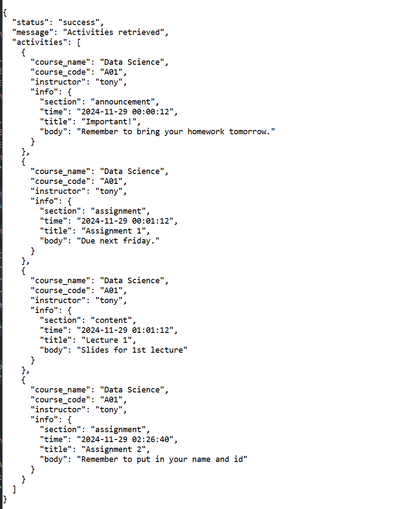

域名 `https://chat.lamitt.com`

username 唯一 不会重复 

/register  注册时 nickname 默认为 username

`curl -vv -X POST https://chat.lamitt.com/register -d '{"username":"test","password":"password","security_answer":"YourName","auth_code":"HERE IS YOUR AUTH TOKEN"}'`

成功返回 `{"status":"success","message":"Admin registration successful","nickname":"test"}`

验证码错误返回 `{"status":"fail","message":"Invalid auth code"}`

用户名重复返回 `{"status":"fail","message":"Username already exists"}`

/login

`curl -vv -X POST https://chat.lamitt.com/login -d '{"username":"test","password":"password"}'`

成功返回 `{"status":"success","message":"Login successful","nickname":"test"}`

失败返回 `{"status":"fail","message":"Invalid username or password"}`

/get_role

`curl -vv https://chat.lamitt.com/get_role?username=test`

返回 `{"status":"success","message":"Role retrieved","role":"instructor"}`

查无此人返回 `{"status":"fail","message":"User not found"}`

/get_info

`curl -vv https://chat.lamitt.com/get_info?username=test`

返回 `{"status":"success","message":"Info retrieved","nickname":"Wow","role":"instructor"}`

/change_info 大杂烩

username必填 查无此人返回 `{"status":"fail","message":"User not found"}`

接受 `old_password, new_password, security_answer, nickname` 作为可选参数

同时填写 `old_password, new_password` 为修改密码 

原密码错误返回 `{"status": "fail", "message": "Invalid password"}` 成功返回 `{"status": "success", "message": "Password changed"}`

同时填写 `old_password, security_answer` 为修改密保答案

原密码错误返回 `{"status": "fail", "message": "Invalid password"}` 成功返回 `{"status": "success", "message": "Security answer changed"}`

同时填写 `new_password, security_answer` 为重置密码

密保错误返回 `{"status": "fail", "message": "Invalid security answer"}` 重置成功返回 `{"status": "success", "message": "Password changed"}`

填写 `nickname` 为修改昵称

不存在不成功 返回 `{"status": "success", "message": "Nickname changed"}`

都不匹配返回 `{"status": "fail", "message": "Invalid request"}`

---

course_code 唯一标识课程

/get_courses

`curl -vv https://chat.lamitt.com/get_courses`

返回所有课程 `{"status":"success","message":"Courses retrieved","courses":[{"course_name":"Data Science","course_code":"A01","instructor":"tony","students":["test"]}]}`

courses: list[course], students: list[username]

/select_course

`curl -vv -X POST https://chat.lamitt.com/select_course -d '{"action":"drop","username":"test","course_code":"A01"}'`

action 可选 `add, drop` 代表选退课 同时会加入退出相应的讨论组

成功返回 `{"status": "success", "message": "Course added"}` | `{"status": "success", "message": "Course dropped"}`

**以 title 为标识符**

/get_courseinfo

`curl -vv 'https://chat.lamitt.com/get_courseinfo?course_code=A01&section=announcement'`

section 可选 announcement assignment content

返回 `{"status":"success","message":"Course info retrieved","infos":[{"course_code":"A01","section":"announcement","by":"tony","time":"2024-11-29 00:00:12","title":"Important!","body":"Remember to bring your homework tomorrow.","file_id":""}]}`

file_id 为空代表没有附带文件

/add_courseinfo

`curl -vv -X POST https://chat.lamitt.com/add_courseinfo -d '{"course_code":"A01","section":"assignment","username":"tony","title":"Assignment 2","body":"Remember to put in your name and id"},"file_id":"xxx"'`

需要对应课程的 instructor 才能更新内容 如果已经存在同一 title 则更新内容和时间

返回 `{"status": "success", "message": "Course info updated"}` | `{"status": "success", "message": "Course info added"}`

/activity

`curl -vv 'https://chat.lamitt.com/activity?username=test'`

返回

---

room_code 唯一标识聊天室 课程的讨论组 room_code == course_code

/get_chats

`curl -vv https://chat.lamitt.com/get_chats?username=test` 必须带上 username 否则返回 `{"status": "fail", "message": "Username not specified"}`

正常返回 `{"status":"success","message":"Chats retrieved","rooms":[{"room_id":"A01","room_name":"Data Science Discuss Group","owner":"tony"}]`

rooms: list[room]

/create_chat

`curl -vv -X POST https://chat.lamitt.com/create_chat -d '{"room_code":"G01","room_name":"A New Group","username":"test"}'`

room_code 重复返回 `{"status":"fail","message":"Chat already exists"}`

正常返回 `{"status":"success","message":"Chat created"}`

创建者默认为 owner

/get_users 或许有用呢

`curl -vv https://chat.lamitt.com/get_users?room_code=A01`

找不到聊天室返回 `{"status": "fail", "message": "Chat not found"}`

正常返回 `{"status":"success","message":"Members retrieved","users":["tony","test"]}`

users: list[username]

/edit_user

`curl -vv -X POST https://chat.lamitt.com/edit_user -d '{"room_code":"G01","action":"remove","username":"test"}'`

action 可选 `add,remove` 课程组不能做修改 不能把owner踢出

返回 `{"status": "success", "message": "User added"}` | `{"status": "success", "message": "User removed"}`

 

/get_messages

`curl -vv https://chat.lamitt.com/get_messages?room_code=A01` 必须带上 room_code

返回 `{"status":"success","message":"Messages retrieved","messages":[{"sender":"tony","message":"Hello!","time":"2024-11-29 00:00:01","file_id":""}]}`

messages: list[message] 

时间格式为 `%Y-%m-%d %H:%M:%S`    如果消息附有文件 file_id 内是对应的文件 ID

/send_message 暂时没做推送通知

`curl -vv -X POST https://chat.lamitt.com/send_message -d '{"room_code":"A01","sender":"test","message":"Hi.","file_id":"xxx"}'`

如果附有文件一并发送 file_id 否则留空

发送正常返回 `{"status":"success","message":"Message sent"}`

---

文件上传下载

/upload_file

上传方式参考微信群的截图

返回 `{"status":"success","message":"File uploaded","file_id":"6748a4a4a1565782cdc26ba1"}`

/download_file

`curl -vv https://chat.lamitt.com/download_file?file_id=6748a4a4a1565782cdc26ba1 --output some.pdf`

返回 [StreamingResponse](https://fastapi.tiangolo.com/zh/advanced/custom-response/#streamingresponse) 或许直接跳转到浏览器打开？